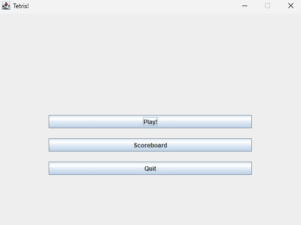
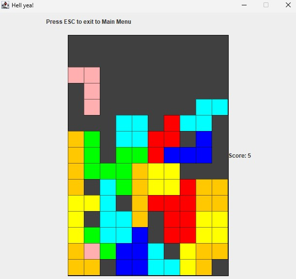
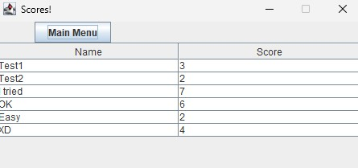

# 🎮 MyTetrisGame
[**PL**]
**MyTetrisGame** - to prosta gra stworzona na zaliczenie przedmiotu dotyczącego tworzenia GUI w języku Java. 
Projekt bazuje na klasycznym **Tetrisie** i został zaimplementowany z użyciem biblioteki **Swing** (`javax.swing`) i grafiki 2D.

---

[**EN**]
**MyTetrisGame** - is a simple game created as part of a course on GUI development in Java. 
The project is based on the classic game **Tetris** and was implemented using the Swing library (`javax.swing`) and 2D graphics.

---

## Media





---

## 🚀 Download

### 🔧 Launch

#### Option 1: From .jar file

1. Download file [Game.jar](Executables/Game_jar/Game.jar) and run it.
#### Option 2: With IDE (i.e. IntelliJ IDEA)

1. Clone repository:
   ```bash
   git clone https://github.com/kamyk0000/Projects.git
   
2. Open project in IDE.

3. Set the default class: `Game.MyTetris` as main and run the project.

---

### 🎮 Keybinds
|  Key  | Function        |
|:-----:|-----------------|
|   ←   | Move left       |
|   →   | Move right      |
|   ↓   | Accelerate fall |
|   ↑   | Rotate          |
| Space | Drop            |
|  Esc  | Exit            |

