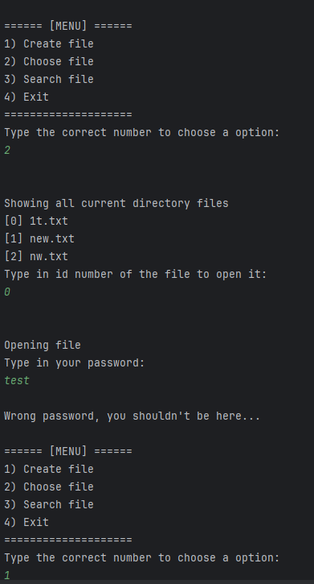

# 🔑 PasswordAndFileEncoder
[**PL**]
**PasswordAndFileEncoder** - to bardzo prosta aplikacja konsolowa, napisana w języku **C++** do tworzenia i enkrypcji plików tekstowych za pomocą haseł i przesunięć bitowych.

---

[**EN**]
**PasswordAndFileEncoder** - is a very simple console application, written in **C++** language, for creating and encrypting text files using passwords and bitwise shifts.

---   
## Media

