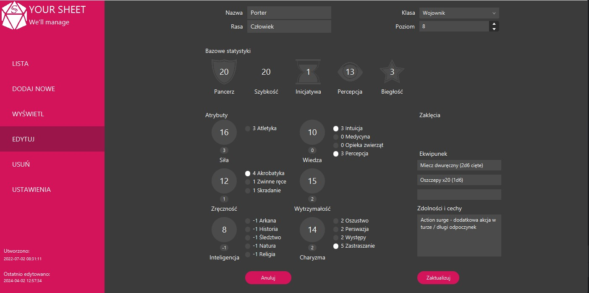

# 🧙‍♂️ SheetManagerForDnD 
[**PL**]
**SheetManagerForDnd** - to aplikacja graficzna do ogólnego zarządzania kartami postaci do gier z gatunku **Dungeons & Dragons**. 
Projekt został napisany w języku **Java** z wykorzystaniem biblioteki `javafx` i powstał w drugim roku studiów PJATK, 
na potrzeby zaliczenia przedmiotu dotyczącego nauki o graficznych interfejsach użytkownika.

Celem projektu było umożliwienie przeglądania, edytowania i organizowania kart postaci w przejrzysty i przyjazny sposób - bez konieczności korzystania z arkuszy kalkulacyjnych czy papieru.

---

[**EN**]
**SheetManagerForDnd** - is a graphical application designed for general management of character sheets for Dungeons & Dragons-style games. 
The project was written in **Java** using the `javafx` library and was created on the 2nd year of studies at PJAIT, as part of a course focused on graphical user interfaces.

The goal of the project was to provide a clear and user-friendly way to view, edit, and organize character sheets - without the need for spreadsheets or paper.

---

## Media




---

## 🚀 Download

### 🔧 Launch

#### Option 1: From .jar file

1. Download file [SheetManager.jar](Executables/SheetManager_jar/SheetManager.jar) and run it.
#### Option 2: With IDE (i.e. IntelliJ IDEA)

1. Clone repository:
   ```bash
   git clone https://github.com/kamyk0000/Projects.git

2. Open project in IDE.

3. Set the default class: `Main` as main and run the project.

---