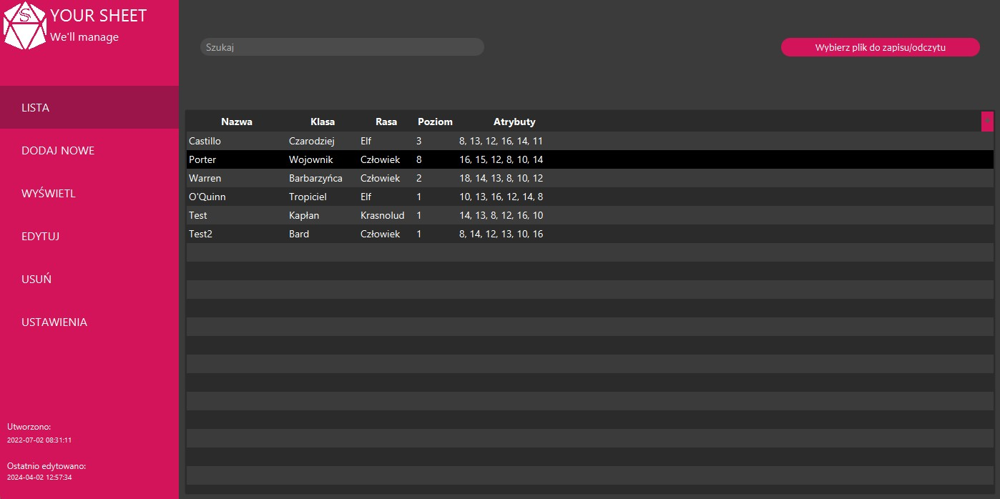

# 🧙‍♂️ SheetManagerForDnD 
[**PL**]
**SheetManagerForDnd** - to aplikacja graficzna do ogólnego zarządzania kartami postaci do gier z gatunku **Dungeons & Dragons**. 
Projekt został napisany w języku **Java** z wykorzystaniem biblioteki `javafx` i powstał w drugim roku studiów PJATK, 
na potrzeby zaliczenia przedmiotu dotyczącego nauki o graficznych interfejsach użytkownika.

Celem projektu było umożliwienie przeglądania, edytowania i organizowania kart postaci w przejrzysty i przyjazny sposób - bez konieczności korzystania z arkuszy kalkulacyjnych czy papieru.

---

[**EN**]
SheetManagerForDnd is a graphical application designed for general management of character sheets for Dungeons & Dragons-style games. 
The project was written in **Java** using the `javafx`  library and was created on the 2nd year of studies at PJAIT, as part of a course focused on graphical user interfaces.

The goal of the project was to provide a clear and user-friendly way to view, edit, and organize character sheets - without the need for spreadsheets or paper.

---

## Media

