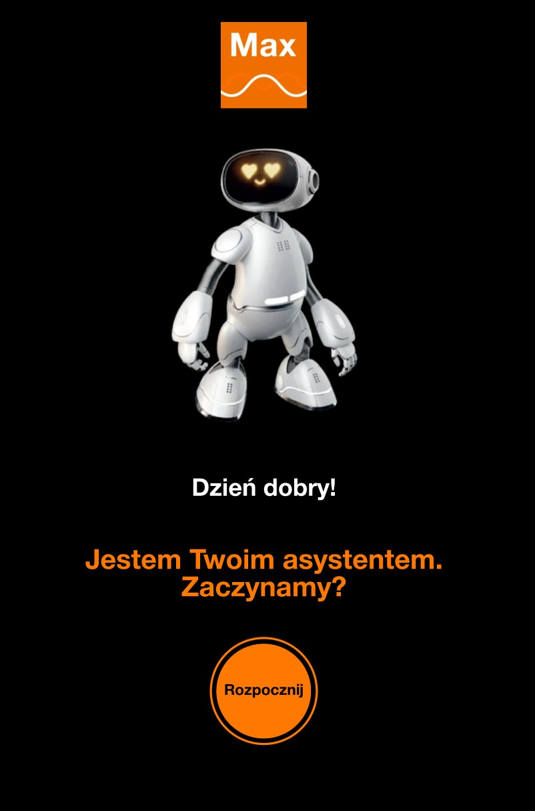

# 🎨 UX/UI
[**PL**]
**Maksio** - to 4os. projekt UX/UI aplikacji asystenta "Max" od Orange, ukierunkowanego na różne grupy wiekowe.
Poprzedzony badaniami rynku (konkurencji), wywiadów, user stories i person oraz zakończone [raportami użytkowymi](Usability%20Test%20Report.pdf). 
---

[**EN**]
**Maksio** - is a 4-person UX/UI design project for Orange's "Max" assistant application, targeted at various age groups.
It was preceded by market research (competition analysis), interviews, user stories, and personas, and conclu`ded with [usability reports](Usability%20Test%20Report.pdf).
---

## Preview (click on the photo)

---

## 🚀 Download

### 🔧 Launch

1. Download file [Prototype.fig](Prototype.fig) and run it.